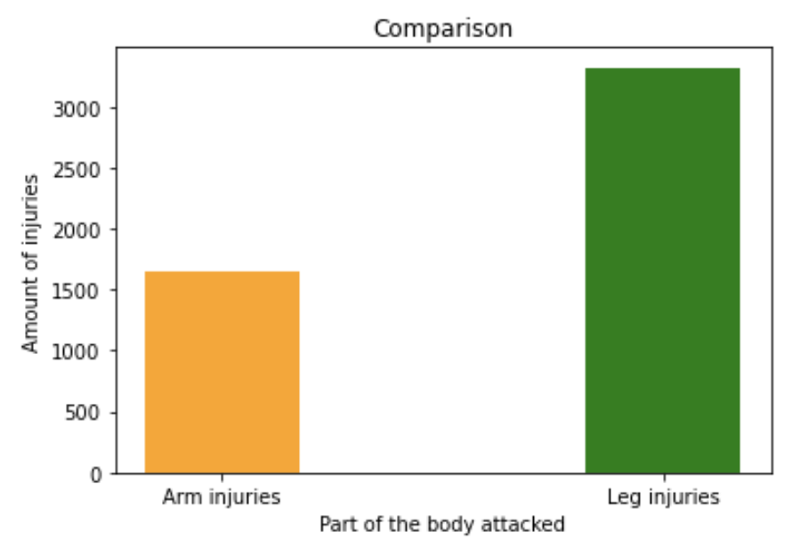
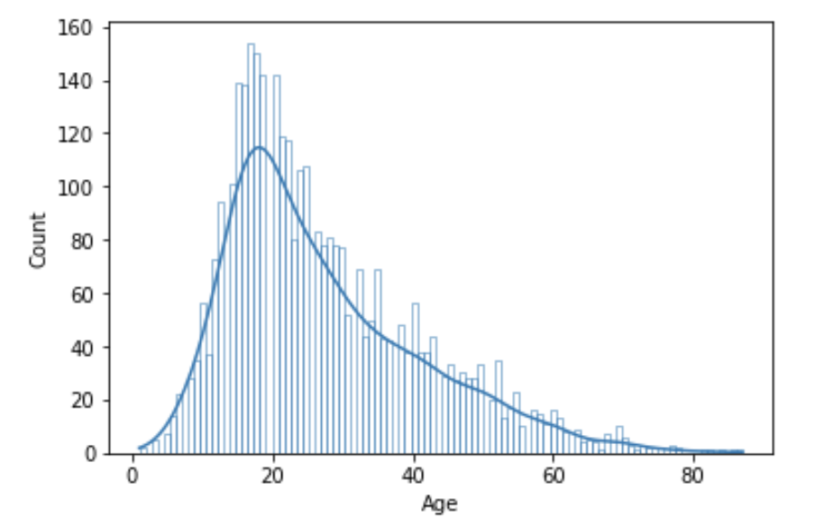
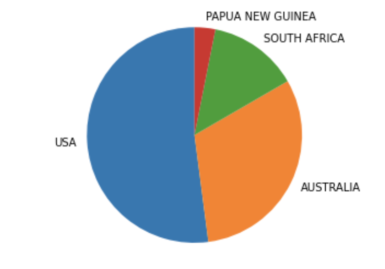
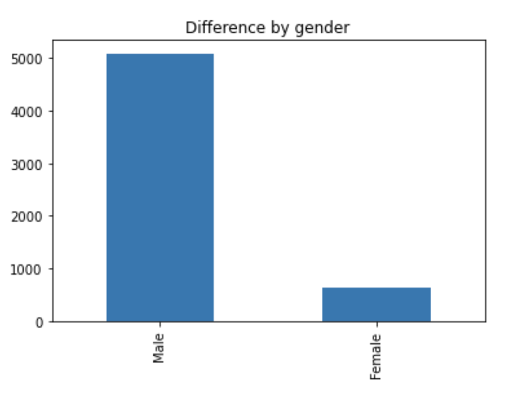
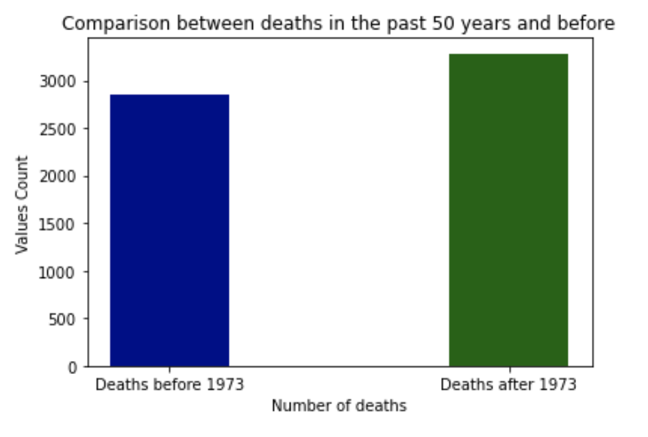

# Sharks

## 1. Introduction

- This case is going to study the attacks of sharks on humans since we have a record of it. 
- The case will explore different hypotheses and try to prove them by analyzing the data provided.
- The study is using a data set which at first is very messy and will try to clean it as much as possible to test the hypotheses.

## 2. Hypotheses

1. First Hypothesis: Sharks attack legs more frequently than arms.
2. Second Hypothesis: What is the sharks favourite meal? Who is the most likely to be attacked by a shark (age, gender, country)?
3. Third Hypothesis: There has been an increase in the number of shark attacks in the past 50 years compared to the rest of recorded history.

## 3. First steps, importing and cleaning

The first step was to import the data and then filter it by counting the number of null values in each row. This reduced the data set from 25723 to 6309. Next, duplicates and unnecessary columns were removed, and the remaining columns were cleaned to provide useful data for analysis. The final cleaned dataset was exported as a CSV file called "clean_sharks.csv".

## 4. Next steps, analysing and proving hypotheses

The analysis is divided into three parts, testing each hypothesis to determine its validity.
The first hypothesis was tested by using the "Injury" column. A list of keywords was created to refer to every body part in a leg or arm. A function was created to iterate through each instance of a body part in the "Injury" column and add 1 to either "arm" or "leg". A bar plot was created to visualize the results.

For the second hypothesis, three columns were analyzed. The "Age" column was visualized using a bar plot to determine the age group most frequently attacked. 

The "Country" column was analyzed using a pie chart to determine the country with the most shark attacks. 

Lastly, the occurrences of male and female attacks were counted and compared using a graph.

For the third hypothesis, another function was used to compare the number of attacks in each time period. First, values equal to 0 were deleted. Then, the number of attacks from 1973 to present was counted and compared to the number of attacks from 0 to 1973 (excluding null values). A graph was created to visualize the results.

## 5. Results on Hypotheses.

- The first hypothesis was proven correct: Sharks attack legs with double the frequentcy as arms.
- The second hypothesis gave the following result: The most common shark attack victim is a 17-year-old American male.
- The third hypothesis was also proven correct: There has been a significant increase in the number of shark attacks in the past 50 years compared to previous recorded history.

The End.

